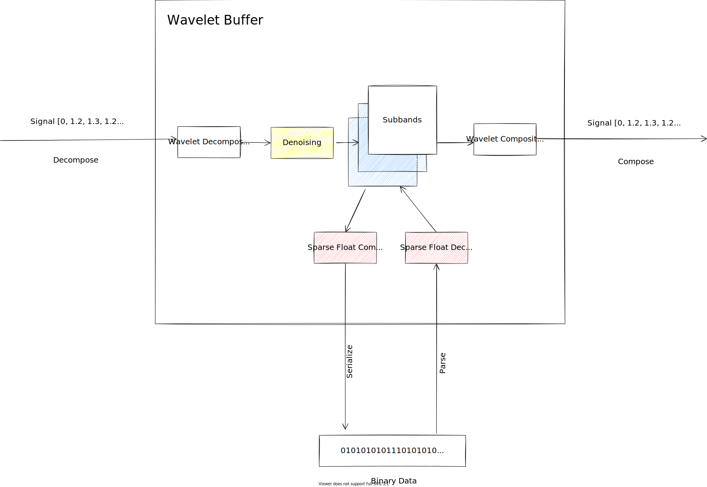

# WaveletBuffer In A Nutshell

Wavelet Buffer (WB) is a core technology for data processing in the PANDA|Drift Platform. It provides the following
features:

* Storing data as wavelet subbands so that you can restore the smallest version of the signal
* Denoising high-frequency spectrum
* Compressing data with float-compression, so you can choose the proper “float” for your data with adjustable size of
  the mantissa.

## The Simplest Explanation of Wavelet Decomposition

There is a beautiful and tricky math behind the wavelet decomposition, but for our engineering tasks it is enough to
consider the wavelet decomposition as a cascade of low-pass and high-pass filters + N/2 resampler. When we pass our
signal through the low-pass filter, we have twice smaller version of our signal (approximation or low frequency subband)
. When we pass
our signal through the high-pass filter, we have twice smaller subband with details and noise (detalization or
high-frequency subband).

So in the end we have two subbands of N/2 size that can be composed again, and we can have the original signal. This
approach has the following advantages:

1. We have noise in the high-frequency subband separately of the low frequency signal, and we can denoise it by setting
   the small values to zero and make the subband sparse. This is a critical part because when you measure some vibration
   of some machine that is currently stopped, you have only noise instead of the signal. So, we can reduce the size of
   this data almost to zero and store only the real signal on the disk.
2. We have a smaller version of the signal in low-level subband. For example, if we would like to show our signal in the
   browser and the monitor has resolution 1920x1200, it doesn’t make any sense to provide the signal with the size more
   than 1920 points. So, we can compose only some low-level subbands without reconstructing the whole original signal.

In the diagram, I showed only one step of the decomposition, but we can decompose the signal recursively, by applying
the wavelet
decomposition on the low-frequency subband again. Therefore, we can decompose our signal to a few subbands: N/1 H-freq
subband, N/2 H-freq subband, …. N/M L-freq subband, where N size of the original signal and M – the number of the
decomposition steps. When we make many steps of the decomposition, we do better denoising and zooming because now we can
get signal of sizes N/2, N/4 … or N/M.

Wavelet Decomposition can be applied to 2-D matrices, the difference is that we have 4 types of subbands:

* Low frequency approximation
* High frequency detalization by vertical
* High frequency detalization by horizontal
* High frequency detalization by diagonal

Here you can see how it looks like for one decomposition step:

## Structure

In a nutshell, Wavelet is just a wrapper around the wavelet subbands:

It has 4 main methods:

* **Decompose**. It decomposes the input signal to the subbands and denoises the high-frequency ones.
* **Compose**. It reconstructs the original signal from subbands. It may reconstruct only few steps of the decomposition
  so that we can get approximation of the signal N/2, N/4 or N/M (N size of original signal, M—number decomposition
  steps) and spare some computation time.
* **Serialize**. However, subbands are sparse after denoising, they still contain zeros in the memory and occupy the
  same memory space as before denoising. This method compresses the subbands to binary data with **Sparse Float
  Compression** algorithm. We use it before saving a Wavelet Buffer onto the disk or sending it through network. You can
  read about it below.
* **Parse**. Decompresses a Wavelet Buffer and restores subbands

## Sparse Float Compression

Sparse Float Compression Algorithm is a specific compression algorithm to compress sparse float data. It does three
things:

1. Removing zeros and add leave only values.
2. Compressing the data, so that the more frequent values spend fewer bits for encoding.
3. Casts the values of the subbands to an adjustable float container, so that we can choose the size of float mantissa.
   We need it if we have lower resolution of our data, and 32-bit float is too big for this.

The current implementation of the compressor supports the following size of the mantissa:

| Size in bits                               | Compression level in WaveletBuffer::Serialize |
|--------------------------------------------|-----------------------------------------------|
| No compression. The algorithm is bypassed. | 0                                             |
| 23 (float32)                               | 1                                             |
| 21                                         | 2                                             |
| 20                                         | 3                                             |
| ...                                        | ...                                           |
| 7 (bfloat)                                 | 16                                            |

!!! warning
    Because we use float values, we always have some error, which depends on the range of the values. You should adjust
    compression level by using knowledge about your data.

## Scalar Values

Some data don’t need any denoising and compression, for example GPS coordinates or slow data from automation systems. In
this case, we can switch off the compression and wavelet composition in WB and make it simple and stupid a vector or
matrix of the data.

## Wavelet Functions

WaveletBuffer supports a few wavelet functions to tweak the wavelet decomposition:

| Name | Description                                                                                                                      |
|------|----------------------------------------------------------------------------------------------------------------------------------|
| NONE | No wavelet decomposition and denoising. See Scalar Values  for detail.                                                           |
| DB1  | [Daubechies wavelet](https://en.wikipedia.org/wiki/Daubechies_wavelet) DB2 or [Haar](https://en.wikipedia.org/wiki/Haar_wavelet) |
| ...  | ..                                                                                                                               |
| DB5  | [Daubechies wavelet](https://en.wikipedia.org/wiki/Daubechies_wavelet) DB10                                                      |
